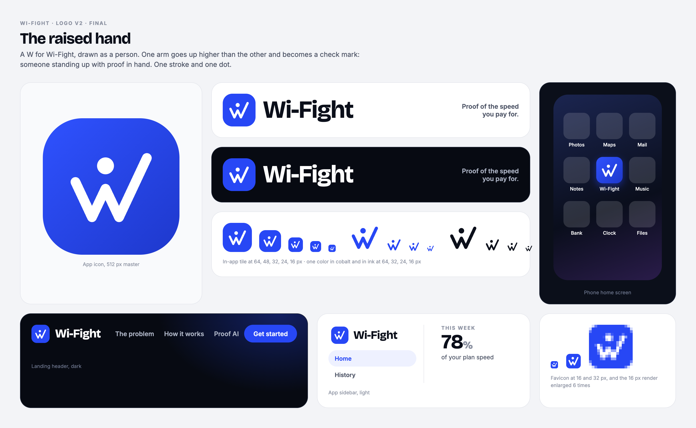
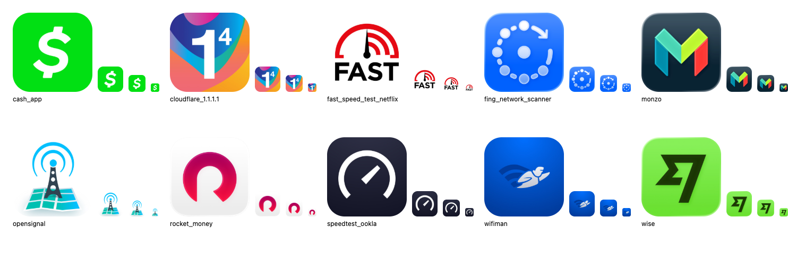
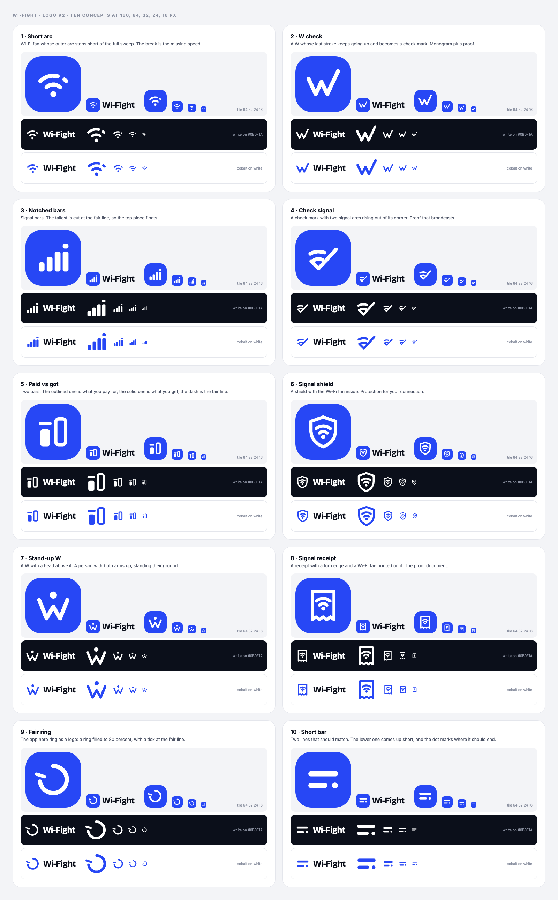
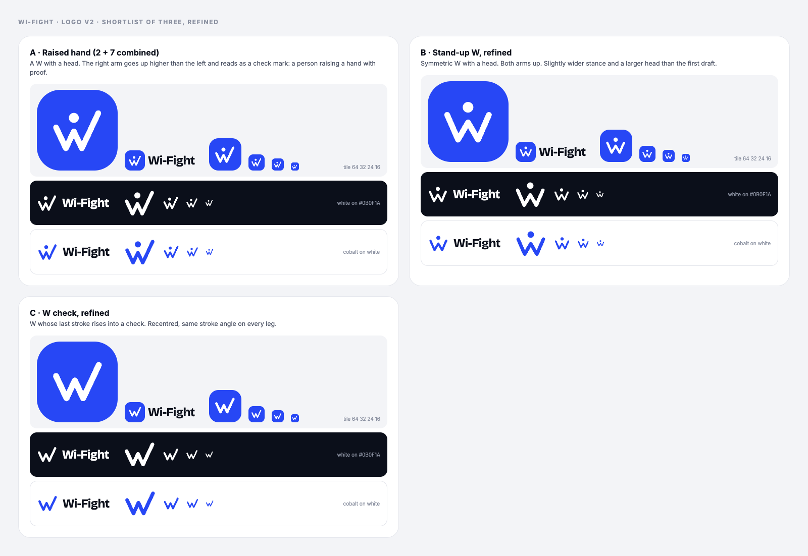

# Logo redesign v2: Wi-Fight

Team DiJITZ, CS 410. This is the record of how the second logo was made: audit, research, brief, ten concepts, test, shortlist, winner. All files are in `design/logo/v2/`.

Result in one line: **the raised hand**. A W drawn as a person, where the right arm goes up higher than the left and becomes a check mark.



## 1. Audit of the current mark

The current mark is a speed gauge arc with a check mark breaking out of it, in white on a cobalt tile (`design/logo/mark.svg`). I looked at it in the live app header at 1440 and 393 px wide.

What works:

- The cobalt tile is strong and already consistent across the app. Keep it.
- The check mark says "verified", which fits the product.
- The lockup with Bricolage Grotesque is confident and readable.

What is weak:

- **It is too close to Speedtest by Ookla.** Their icon is a white gauge arc with a needle on a dark rounded square. Ours is a white gauge arc with a check on a blue rounded square. Side by side, ours looks like a variation of theirs. This is the biggest problem.
- **It says "speed test", not "Wi-Fight".** Nothing in it connects to the name, to Wi-Fi, to fairness, or to a person standing up to a provider. It could be the icon for any dashboard or performance tool.
- **It is three separate pieces.** Arc, small arc stub, check. At 16 px the stub on the right becomes a stray dot and the arc and check merge into a blob.
- **It is hard to draw from memory.** People remember "a circle thing with a tick" but not where the gap is.
- **The view box is offset** (`0 -1.3 24 24`) to fake the vertical centre. That is a sign the drawing itself is not balanced.

## 2. Research

I pulled the current App Store icons for ten apps and looked at each at 150, 48, 32 and 16 px. The sheet is saved as `logo/v2/references.png`. The goal was to learn how they are built, not to copy any of them.



**Speed and network tools**

- **Speedtest by Ookla.** One open gauge arc and one needle, white on near black. Two shapes, heavy strokes, and it still reads at 16 px. It owns the gauge so completely that any other gauge looks like a copy.
- **FAST (Netflix).** A red gauge with Wi-Fi style arcs and a needle, sitting on the word FAST. It relies on the word, so at 16 px it turns into a smudge. Lesson: do not put letters or fine detail in the icon.
- **Fing.** A ring of dots with an arrow, on blue. Friendly, but many small parts. At 16 px the dots merge into a fuzzy circle.
- **WiFiman.** A flying character with Wi-Fi arcs as a trail. It has personality at large size and is unreadable at small size. Lesson: a character is memorable, but only if it is built from very few shapes.
- **Opensignal.** A tower with signal arcs on a map. Detailed illustration, weak when small.
- **Cloudflare 1.1.1.1.** A big numeral on a gradient. The numeral carries it. Lesson: one bold glyph survives any size.

**Consumer finance and "on your side" brands**

- **Wise.** The "fast flag": one solid angular shape, dark on bright green. Their rebrand notes say the shapes were redrawn heavier with open inner spaces so they stay clear when small.
- **Monzo.** A single letter M made of folded planes. The letter does the recognition work. The community pushed back when the company considered dropping it, because the M is the first thing people see.
- **Cash App.** One dollar sign, white on green. As simple as a logo gets, and it is the most readable of the ten at 16 px.
- **Rocket Money.** One open ring with a gap, red on white. A single stroke. Note for us: an open ring is taken.

**Trust and proof marks**

- Check marks, shields and seals are understood by everyone, which is also the problem. On their own they look like a system status icon or an antivirus. They work best as one part of a mark that has another idea in it.

**Principles I took from this**

1. The marks that survive at 16 px have one or two shapes and heavy strokes.
2. A letter or a simple figure is easier to remember than an instrument such as a gauge or a tower.
3. The gauge belongs to Speedtest and the plain fan belongs to the Wi-Fi symbol. Stay away from both.
4. The friendly finance brands feel "on your side" because of colour and simple, round, confident shapes. None of them use shields or warning symbols.
5. A check mark is fine as an ingredient, not as the whole idea.

Sources: [Speedtest logo record](https://logotyp.us/logo/speedtest/), [Wise rebrand, Creative Review](https://www.creativereview.co.uk/wise-rebrand-ragged-edge/), [Wise rebrand interview, The Brand Identity](https://the-brandidentity.com/interview/how-the-ragged-edge-and-wise-teams-came-together-to-craft-a-pivotal-rebrand-for-the-worlds-money), [Ragged Edge case study](https://raggededge.com/work/wise/), [Monzo community thread on the M](https://community.monzo.com/t/monzo-logo-design-change/56760/108), [Truebill to Rocket Money](https://help.rocketmoney.com/en/articles/6445754-rocket-money-rebrand-faqs). Icons were fetched from the public App Store listing for each app. Mobbin was searched for splash screens but did not return these apps, so the App Store icons were used.

## 3. Framework: the brief

**Brand idea in one line:** Wi-Fight stands next to you and proves whether you get the internet you pay for.

**Three attributes:** on your side, proven, plain.

**Hard criteria**

| # | The mark must | 
|---|---|
| 1 | Read at 16, 24, 32, 64 and 512 px |
| 2 | Work in one colour and reversed |
| 3 | Work on dark and on light |
| 4 | Be recognisable without the word "Wi-Fight" |
| 5 | Be simple enough to draw from memory |
| 6 | Not be confused with the plain Wi-Fi symbol or with a competitor (Speedtest gauge, Rocket Money ring) |
| 7 | Relate to "the gap between promised and delivered" or to "proof" |
| 8 | Drop into the existing 24 unit `.mark` slot using `currentColor` |

Tone check: confident and on your side, not angry. No fists, no lightning, no warning triangles.

## 4. Explore: ten concepts

Each is hand written SVG on a 24 unit grid, in `logo/v2/concept-N.svg`.

| # | Name | Idea |
|---|---|---|
| 1 | Short arc | Wi-Fi fan whose outer arc stops short. The break is the missing speed. |
| 2 | W check | A W whose last stroke keeps rising and becomes a check mark. |
| 3 | Notched bars | Signal bars, with the tallest bar cut at the fair line. |
| 4 | Check signal | A check mark with two signal arcs rising out of its corner. |
| 5 | Paid vs got | Two bars, outlined for paid and solid for got, with a fair line dash. |
| 6 | Signal shield | A shield with the Wi-Fi fan inside. |
| 7 | Stand-up W | A W with a head above it: a person with both arms up. |
| 8 | Signal receipt | A receipt with a torn edge and a Wi-Fi fan printed on it. |
| 9 | Fair ring | The app's hero ring: filled to 80 percent, with a tick at the fair line. |
| 10 | Short bar | Two lines that should match. The lower one is short and a dot marks where it should end. |

## 5. Test

Every concept was rendered at 160, 64, 32, 24 and 16 px, as a white mark on the cobalt tile, white on `#0B0F1A`, and cobalt on white, each next to the wordmark.



Honest scores against the brief:

| # | Concept | 16 px | Own shape | Says gap or proof | Verdict |
|---|---|---|---|---|---|
| 1 | Short arc | ok | no | weak | Out. It reads as the normal Wi-Fi symbol with a rendering glitch, or as "weak signal". Fails criterion 6. |
| 2 | W check | good | fair | proof, quietly | **Shortlist.** Cleanest at every size. Risk: at a glance it is just a W. |
| 3 | Notched bars | ok | no | weak | Out. It is the phone signal icon. The notch is invisible below 32 px. |
| 4 | Check signal | poor | fair | proof | Out. Three pieces crossing each other. Muddy at 24 px and below. |
| 5 | Paid vs got | ok | no | gap | Out. It reads as the letters "iO" or the number 10. |
| 6 | Signal shield | poor | no | no | Out. It says VPN or antivirus, and the fan inside fills in at 16 px. |
| 7 | Stand-up W | good | good | no | **Shortlist.** Warm and human, reads as a person at once. Does not say proof. |
| 8 | Signal receipt | poor | fair | proof | Out. Too many details. Looks like a generic document icon when small. |
| 9 | Fair ring | good | no | gap | Out. It reads as a refresh or loading icon, and an open ring is Rocket Money's shape. |
| 10 | Short bar | good | fair | gap | Out. Readable but it looks like a text or menu icon. The idea needs a caption to land. |

What the test taught me: every concept built from Wi-Fi arcs, bars or a ring looked like a system icon that already exists. The two that felt like a brand were the ones built on the letter W.

## 6. Shortlist and refine

Concepts 2 and 7 each had half of the answer. Concept 2 had the proof but no warmth. Concept 7 had the person but no proof. So I added a third candidate that joins them.

- **A. Raised hand.** The W check from concept 2 with the head from concept 7. The head sits over the middle peak. The left arm is short, the right arm goes high and is the check mark.
- **B. Stand-up W, refined.** Wider stance, bigger head.
- **C. W check, refined.** Recentred, with the same angle on every leg.

Refinements made on all three: every leg uses the same slope so the strokes look parallel, round caps and joins to match the tile corners, stroke 2.6 on the 24 grid (the same weight as the current mark, so nothing else in the header needs to change), and the drawing is centred in the box so the view box hack is gone.



**Winner: A, the raised hand.**

Why it wins:

- It carries three readings in one stroke and one dot: a W for Wi-Fight, a person standing up, and a check mark for proof. Each reading is part of the brand idea.
- The dot also works as the "i" in "Wi", and as the source dot of a Wi-Fi symbol, without drawing the Wi-Fi symbol.
- It is the only candidate that shows a person. The product is for households, and the name is about standing up for yourself. A raised hand is "I have something to say", which is confident without being aggressive.
- It passes every hard criterion. It reads at 16 px, works in one colour, and can be drawn from memory: "a W with a dot, right arm long".
- It looks like nothing in the reference set. No gauge, no fan, no ring.

Why the others lost:

- **B** is friendly but generic. A symmetric figure with both arms up could be a gym, a charity, or a wellness app. It says nothing about proof.
- **C** is the cleanest drawing but the coldest. Without the head it is a W with a long stroke, and many companies have a W.

## 7. Delivered files

All in `design/logo/v2/`:

| File | What it is |
|---|---|
| `mark.svg` | The mark alone, `viewBox="0 0 24 24"`, `currentColor`. One path and one circle. |
| `app-icon.svg` | 512 by 512, mark on the cobalt rounded square (radius 116, same soft gradient as v1). |
| `lockup.svg` | Tile plus "Wi-Fight" as live text in Bricolage Grotesque 700, with Inter and system fonts as fallback. |
| `lockup-dark.svg` | Same, with white text for dark backgrounds. |
| `favicon.svg` | 32 unit tile tuned for 16 and 32 px: heavier stroke (3), larger head, shorter middle peak so the head stays separate. |
| `final.png` | Presentation image: app icon, light and dark lockups, size ladder, mock headers, phone home screen, favicon zoom. |
| `concepts.png`, `shortlist.png`, `references.png` | The test sheets and the research sheet. |
| `concept-1.svg` to `concept-10.svg` | The ten explored concepts. |

Note on the lockup files: the text is live text, so the display font only shows where Bricolage Grotesque is loaded (the app loads it). Elsewhere it falls back to Inter or the system font. For print or slides, convert the text to outlines first.

## 8. Remaining weaknesses

- **At 16 px the head and the W start to touch.** The enlarged favicon in `final.png` shows it. You still read a W with something above it, but the "person" reading is gone below about 20 px. The favicon file is tuned to help, and it is acceptable, but it is not perfect.
- **It does not show the gap.** The brief allowed "gap" or "proof", and the mark chose proof. The 80 percent fair line lives in the app's ring and charts, not in the logo. The uneven arms hint at "what you get versus what you should get", but nobody will see that without being told.
- **It does not say internet on its own.** There are no arcs. The name next to it does that job. As a lone app icon it says "W, a person, a check".
- **W plus check is not a brand new idea.** I did not find the same drawing in the reference set, but W monograms and check mark people both exist in the world. This was a visual review, not a trademark search.
- **No one outside the team has seen it.** A five second test with a few classmates ("what does this app do?") would tell us more than any more drawing.

## 9. How to apply it in the app

Nothing under `app/` was changed. Replace the current inline mark (the three paths inside `.mark`, and the `#i-mark` symbol in `index.html`) with this:

```html
<svg viewBox="0 0 24 24" fill="none" stroke="currentColor" stroke-width="2.6" stroke-linecap="round" stroke-linejoin="round" aria-hidden="true"><path d="M2.5 10.8 6.9 20.2 10.5 12.6 14.1 20.2 21.5 4.4"/><circle cx="10.5" cy="6.5" r="2.25" fill="currentColor" stroke="none"/></svg>
```

For the `<symbol>` version used on the landing page:

```html
<symbol id="i-mark" viewBox="0 0 24 24"><g fill="none" stroke="currentColor" stroke-width="2.6" stroke-linecap="round" stroke-linejoin="round"><path d="M2.5 10.8 6.9 20.2 10.5 12.6 14.1 20.2 21.5 4.4"/><circle cx="10.5" cy="6.5" r="2.25" fill="currentColor" stroke="none"/></g></symbol>
```

Notes:

- The view box is now plain `0 0 24 24`. The old `0 -1.3 24 24` offset is no longer needed.
- **Tile colour:** keep cobalt `#2747F5`. No change.
- **Tile radius:** keep the current ratio, about 29 to 30 percent of the tile side (12 px on a 40 px tile, 11 px on 38 px, 19 px on 64 px). No change.
- **Mark size inside the tile:** the mark looks best at about 66 percent of the tile side. The landing header already does this (26 px in a 40 px tile). The sidebar uses 22 px in a 38 px tile, which is a little small. Suggest 25 px there. The share card on the verdict page (17 px in 26 px) is fine.
- For the browser tab, link `favicon.svg` rather than reusing the inline mark, because it is drawn heavier for small sizes.
